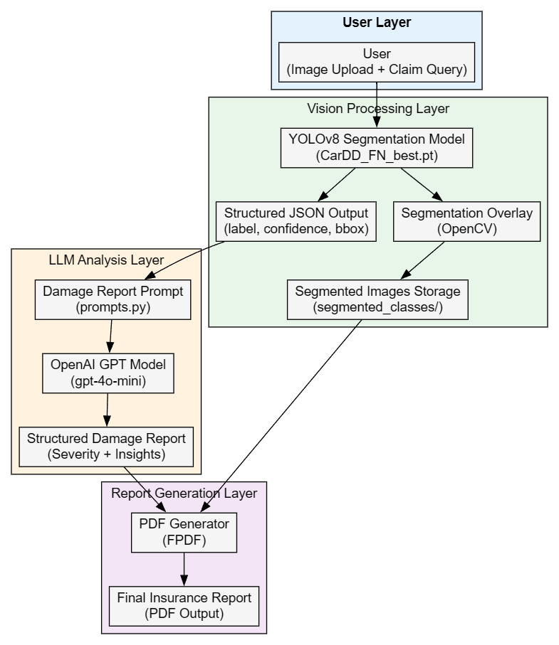

# 🚗 InsuranceAI

### Multimodal AI-Powered Vehicle Damage Assessment & Insurance Report Generator

InsuranceAI is an end-to-end AI system that:

* Detects vehicle damage using YOLOv8 segmentation
* Generates structured insurance damage reports using LLMs
* Creates professional PDF reports
* Visualizes damage masks with labeled overlays
* Designed for integration with Agentic AI systems (LangGraph-ready)

---

## 🎥 Demo

https://github.com/Sanjeevspuranik/InsuranceAI/blob/main/demo/video/InsuranceAI_demo.mp4


## 🏗️ System Architecture




## 📄 Sample Generated Report

[Download Sample Insurance Report](demo/document/damage_report.pdf)

---

## 🔥 Features

* ✅ YOLOv8 Segmentation-based Damage Detection
* ✅ Bounding Box + Mask Predictions
* ✅ GPT-based Insurance Damage Report Generation
* ✅ Automated PDF Report Generation
* ✅ Class-wise Segmentation Visualization
* ✅ Modular Architecture for SaaS / API Deployment

---

# 🧠 Damage Classes

| Class ID | Damage Type   |
| -------- | ------------- |
| 0        | Dent          |
| 1        | Scratch       |
| 2        | Crack         |
| 3        | Glass Shatter |
| 4        | Lamp Broken   |
| 5        | Tire Flat     |

---

# 📊 Model Details

### Task

`segment` (Instance Segmentation)

### Framework

* Ultralytics YOLOv8
* Version: 8.4.14
* Python: 3.12.3
* Torch: 2.10.0 (CPU)
* Hardware: AMD Ryzen 9 6900HS (CPU training/inference)

---

## 📈 Validation Metrics

### Overall Performance

| Metric    | Bounding Box | Mask  |
| --------- | ------------ | ----- |
| Precision | 0.734        | 0.745 |
| Recall    | 0.684        | 0.691 |
| mAP@50    | 0.723        | 0.720 |
| mAP@50-95 | 0.556        | 0.532 |

**Fitness Score:** `1.0877`

---

## 📊 Class-wise Performance

| Class         | Images | Instances | Box mAP50 | Mask mAP50 |
| ------------- | ------ | --------- | --------- | ---------- |
| Dent          | 157    | 236       | 0.629     | 0.627      |
| Scratch       | 183    | 307       | 0.592     | 0.604      |
| Crack         | 48     | 70        | 0.409     | 0.396      |
| Glass Shatter | 71     | 71        | 0.982     | 0.984      |
| Lamp Broken   | 65     | 69        | 0.815     | 0.802      |
| Tire Flat     | 31     | 32        | 0.910     | 0.910      |

---

## ⚡ Inference Speed

| Stage       | Time per Image |
| ----------- | -------------- |
| Preprocess  | 0.9 ms         |
| Inference   | 54.9 ms        |
| Postprocess | 5.1 ms         |

~60ms per image (CPU)

---

# 🏗️ Model Fine-Tuning Details

### Dataset

* 374 validation images
* 785 total instances
* Balanced across 6 vehicle damage classes
* YOLO format labels (segmentation masks)

### Dataset Distribution

```
dent: 236
scratch: 307
crack: 70
glass shatter: 71
lamp broken: 69
tire flat: 32
```

---

### Training Configuration (YOLOv8)

Typical configuration used:

```
Task: segment
Image size: 640
Batch size: (hardware dependent)
Optimizer: SGD / AdamW (default Ultralytics)
Loss:
  - Box loss
  - Mask loss
  - Classification loss
Augmentations:
  - Mosaic
  - HSV augmentation
  - Horizontal flip
  - Scaling
```

Model checkpoint:

```
model/CarDD_FN_best.pt
```

Validation results saved at:

```
runs/segment/val
```

---

# 🏛️ Architecture Overview

```
User Image
    ↓
YOLOv8 Segmentation
    ↓
Structured JSON Extraction
    ↓
LLM Damage Analysis
    ↓
PDF Report Generator
    ↓
Final Insurance Report
```

---

# 📂 Project Structure

```
InsuranceAI/
│
├── model/
│   └── CarDD_FN_best.pt
│
├── dataset/
│   ├── images/
│   └── labels/
│
├── prompts.py
├── your_module.py
├── app.py
└── README.md
```

---

# ⚙️ Installation

```bash
git clone https://github.com/Sanjeevspuranik/InsuranceAI.git
cd InsuranceAI

pip install -r requirements.txt
```

Dependencies:

* ultralytics
* torch
* opencv-python
* numpy
* fpdf
* openai

---

# 🚀 Usage

### 1️⃣ Run Damage Detection

```python
from your_module import predict_image

result = predict_image(img_path="car.jpg")
print(result)
```

---

### 2️⃣ Generate Damage Report

```python
from your_module import generate_damage_report

report = generate_damage_report(result)
print(report)
```

---

### 3️⃣ Generate PDF

```python
from your_module import create_damage_pdf

create_damage_pdf(report)
```

---

### 4️⃣ Visualize Segmentation

```python
from your_module import visualize_segments
from ultralytics import YOLO

model = YOLO("model/CarDD_FN_best.pt")
results = model.predict("car.jpg")

visualize_segments(results)
```

---

# 🧠 LLM Integration

* Uses OpenAI GPT models (default: gpt-4o-mini)
* Structured damage analysis
* Severity assessment
* Repair estimation guidance
* Insurance claim insights

---

# 🔮 Future Roadmap

* [ ] Cost estimation engine per damage class
* [ ] Human-in-the-loop claim approval
* [ ] LangGraph Agentic integration
* [ ] Multi-image claim analysis
* [ ] SaaS API deployment (FastAPI)
* [ ] Mobile upload integration

---

# 🏆 Why InsuranceAI?

* Accurate segmentation-based detection
* High performance on critical classes (Glass, Tire, Lamp)
* CPU-compatible
* Modular production-ready architecture
* Designed for real-world insurance automation

---

# 👨‍💻 Author

**Sanjeev S Puranik**
AI Engineer | Multimodal Systems | Agentic AI
